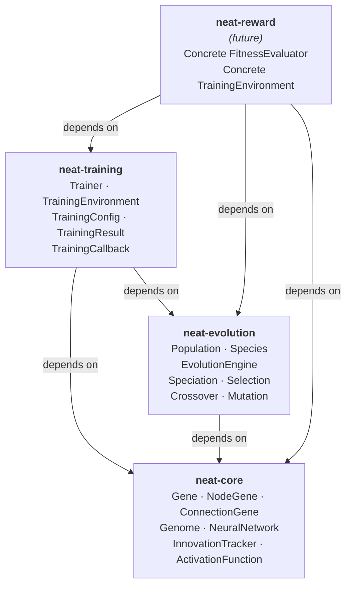
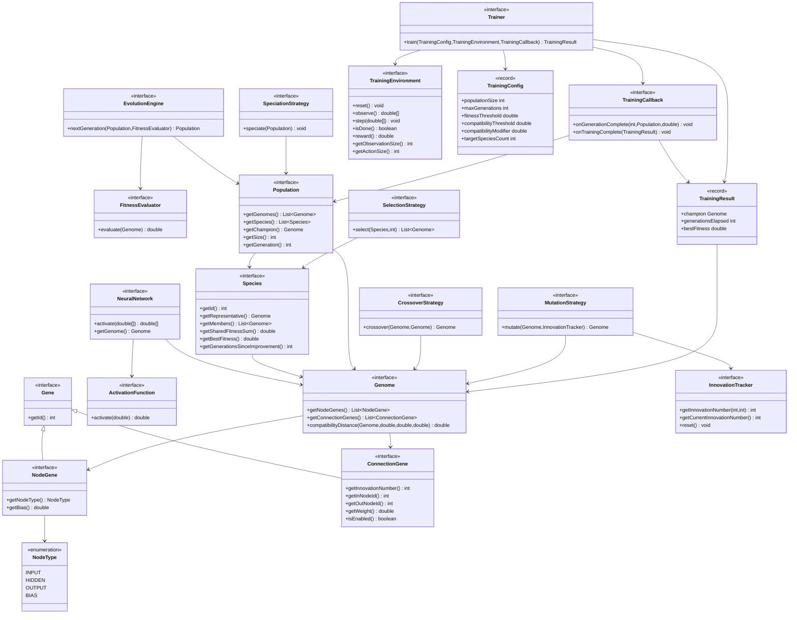
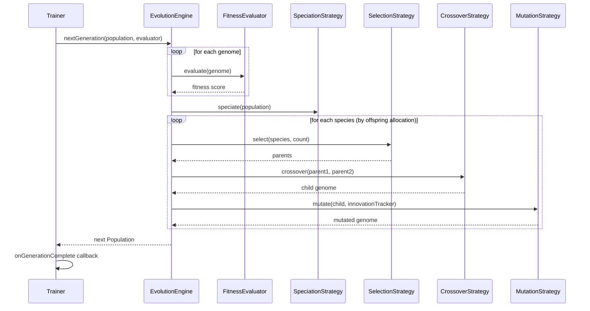

# NEAT — NeuroEvolution of Augmenting Topologies

A multi-module Java 25 scaffold for the NEAT algorithm by Kenneth O. Stanley and Risto
Miikkulainen. NEAT simultaneously evolves the **topology** (structure) and **weights** of
artificial neural networks, starting from minimal networks and complexifying over generations.

> **Status:** Interface-only scaffold. No concrete implementations exist yet — this is the
> architectural skeleton that future implementation tickets will fill in.

---

## Module Overview

| Module | Package | Role |
|--------|---------|------|
| [`neat-core`](neat-core/) | `com.ddiggs.neat.core` | Gene types, Genome genotype, NeuralNetwork phenotype, InnovationTracker, ActivationFunction |
| [`neat-evolution`](neat-evolution/) | `com.ddiggs.neat.evolution` | Population management, Species, all pluggable strategy interfaces, EvolutionEngine |
| [`neat-training`](neat-training/) | `com.ddiggs.neat.training` | Training harness, TrainingEnvironment, Trainer, TrainingConfig, TrainingResult, TrainingCallback |
| *(neat-reward)* | *(future)* | Concrete task environment and FitnessEvaluator implementation |

---

## Module Dependency Graph



---

## Interface Relationship Diagram



---

## NEAT Algorithm — Generational Loop



---

## Getting Started

**Prerequisites:** Java 25+, Maven 3.9+

```bash
# Build all modules
mvn compile

# (After implementations are added)
mvn test
mvn package
```

---

## Architecture Notes

- **Interfaces only.** No concrete classes implement these interfaces yet. Future tickets
  will add implementations in their respective modules and in `neat-reward`.
- **`FitnessEvaluator`** is declared in `neat-evolution` (not `neat-training`) because it is
  a direct input to `EvolutionEngine`. Concrete implementations belong in `neat-reward`.
- **`TrainingConfig` and `TrainingResult`** are Java **records** — immutable, structurally
  transparent, and automatically equipped with `equals`, `hashCode`, and `toString`.
- **Strategy pattern** throughout `neat-evolution` means every algorithm variant
  (e.g. tournament vs roulette selection) is a swappable implementation, with no
  changes to the engine itself.
- **`InnovationTracker`** is owned by `neat-core` because innovation numbers are a property
  of the genome representation, not of any particular evolution strategy.
